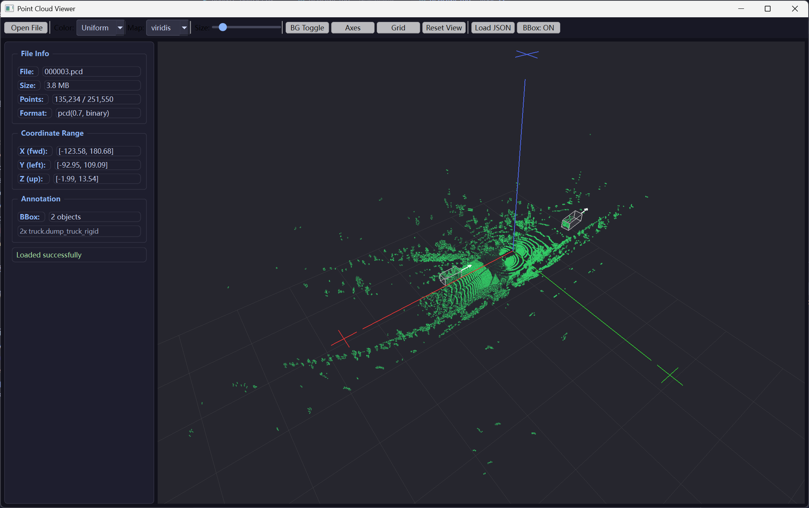

# CloudView

A lightweight 3D point cloud viewer for `.bin` and `.pcd` files, with JSON annotation visualization.

## Features

- **File formats**: Load `.bin` (float32 x4) and `.pcd` (binary/ASCII) point clouds
- **3D rendering**: OpenGL with trackball camera (rotate, pan, zoom)
- **Color modes**: Z-height coloring (viridis/plasma colormaps) or uniform color
- **Scene aids**: RGB coordinate axes (X=red, Y=green, Z=blue), adjustable ground grid
- **Bounding boxes**: Load JSON annotations, display 3D BBox with semi-transparent faces and yaw direction arrows
- **Auto-detection**: Automatically finds matching JSON annotation file for the loaded point cloud
- **Validation**: Detects non-float32 or non-4-column files with clear error messages
- **Drag & drop**: Drop `.bin` or `.pcd` files directly into the window

## Screenshot



## Requirements

- Python 3.9+
- PySide6

```bash
pip install PySide6
```

## Usage

```bash
# Open the viewer
python main.py

# Open with a specific file
python main.py path/to/pointcloud.bin
python main.py path/to/pointcloud.pcd
```

### Controls

| Action | Control |
|--------|---------|
| Rotate | Left mouse drag |
| Pan | Right mouse drag |
| Zoom | Mouse wheel |
| Reset view | Double-click / "Reset View" button |

## Point Cloud Format

The viewer expects float32 binary files with 4 columns per point:

```
[x0, y0, z0, intensity0, x1, y1, z1, intensity1, ...]
```

Each point is 16 bytes (4 × float32).

## Annotation Format

JSON files with 3D bounding boxes:

```json
[
  {
    "obj_id": "1",
    "obj_type": "Car",
    "psr": {
      "position": {"x": 10.5, "y": -3.2, "z": 0.8},
      "rotation": {"x": 0, "y": 0, "z": 1.23},
      "scale": {"x": 4.5, "y": 1.8, "z": 1.5}
    }
  }
]
```

- `position`: Center coordinates (meters)
- `rotation.z`: Yaw angle (radians, counterclockwise around Z axis)
- `scale`: Dimensions (length × width × height, meters)

Annotation files are auto-detected when they share the same name as the point cloud file (different extension).

## Project Structure

```
tool/
├── main.py              Entry point
├── ui_mainwindow.py     Main window with toolbar and info panel
├── gl_viewer.py         OpenGL 3D renderer with camera controls
├── pointcloud_loader.py Bin/PCD file loading and validation
├── annotation_loader.py JSON annotation loading and BBox computation
└── colormap.py          Color mapping (viridis, plasma)
```

## License

MIT
